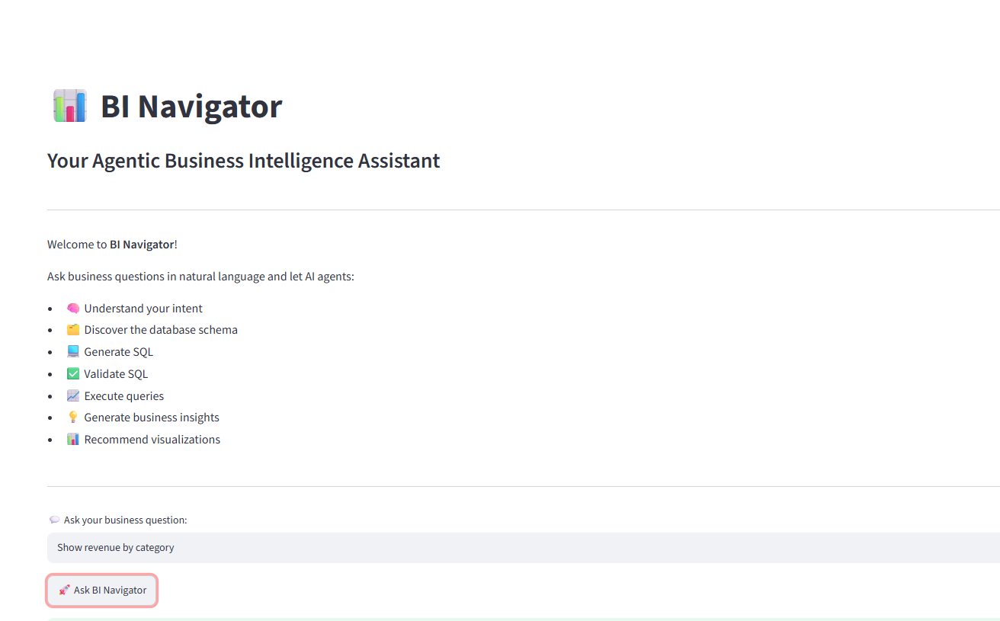
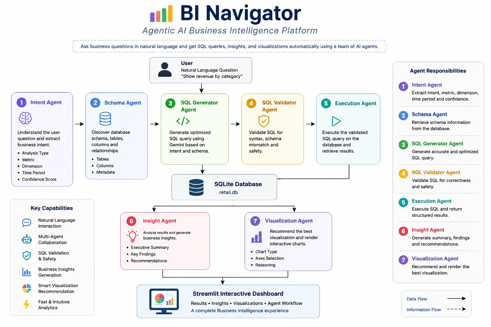
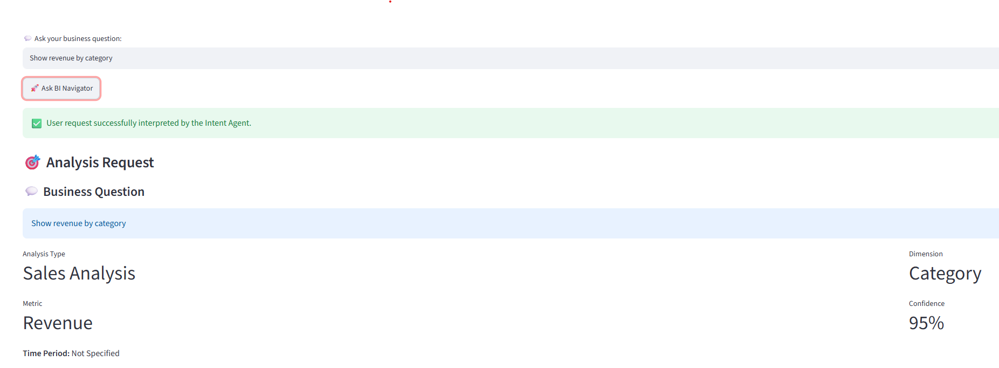
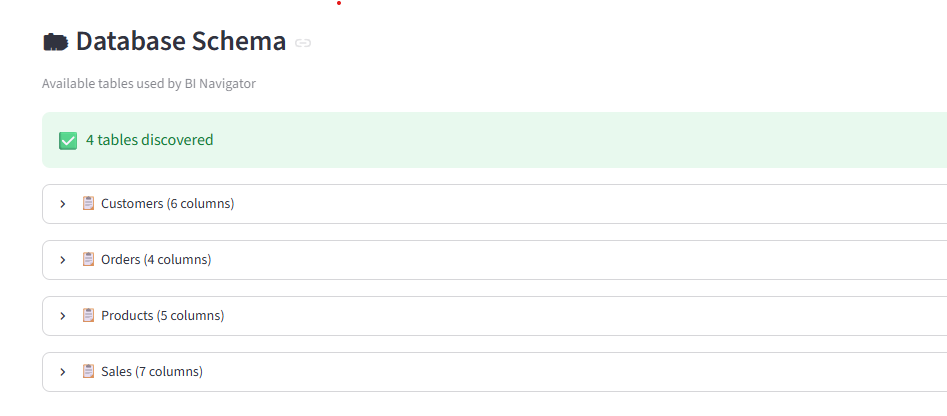
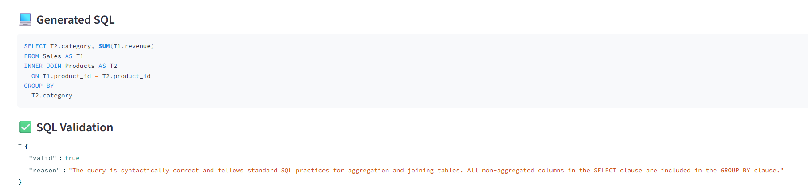
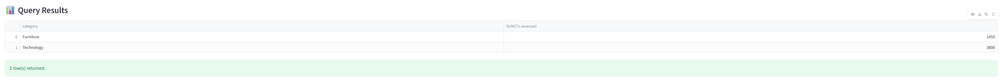
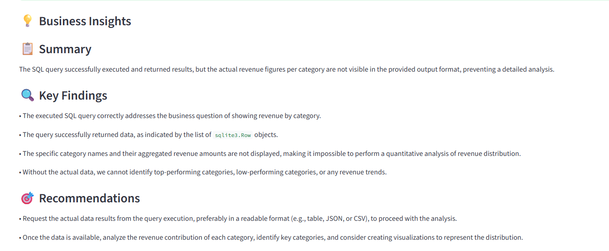
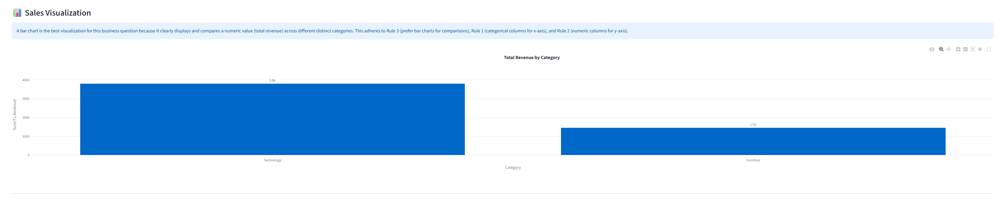
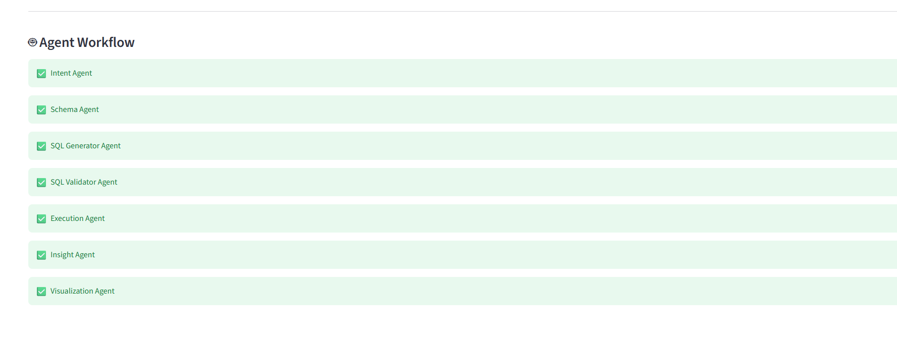

\# 📊 BI Navigator


<p align="center">
  
</p>


\## Your Agentic Business Intelligence Assistant


BI Navigator is an AI-powered Business Intelligence Assistant that enables users to ask business questions in natural language and automatically converts them into SQL queries, executes them against a database, generates business insights, and recommends interactive visualizations.


Built using a collaborative multi-agent architecture powered by Google Gemini, BI Navigator demonstrates how Agentic AI can simplify analytics workflows and make business intelligence accessible to everyone.


## 📑 Table of Contents

- [Project Overview](#-project-overview)
- [Architecture](#architecture)
- [Demo](#demo)
- [Technology Stack](#-technology-stack)
- [Project Structure](#-project-structure)
- [How to Run](#-how-to-run)
- [Screenshots](#-screenshots)
- [Future Enhancements](#-future-enhancements)

\---

## 🚀 Features at a Glance

- 💬 Ask questions in plain English
- 🧠 Intent Analysis
- 🗄 Automatic Schema Discovery
- ⚙ SQL Generation using Gemini
- ✅ SQL Validation
- 📈 Interactive Visualizations
- 💡 AI-generated Business Insights
- 🤖 Multi-Agent Architecture

\# 🚀 Project Overview


Business users often depend on analysts or engineers to retrieve insights from enterprise databases because writing SQL queries requires technical expertise.


BI Navigator bridges this gap by allowing users to interact with data using natural language.


Instead of writing SQL manually, users simply ask a question like:


> "Show revenue by category."


The application automatically:


✅ Understands user intent


✅ Discovers the database schema


✅ Generates SQL


✅ Validates SQL


✅ Executes the query


✅ Generates business insights


✅ Recommends the best visualization


This creates a seamless analytics experience powered by multiple AI agents working together.


\---


## Why BI Navigator?

Traditional BI platforms require technical users to understand SQL, schemas, and visualization tools.

BI Navigator demonstrates how autonomous AI agents can collaborate to transform natural language into actionable business insights, making analytics accessible to everyone.


## Architecture



---

## Demo

(Demo Video Coming Soon)


Organizations collect enormous amounts of business data, yet accessing meaningful insights often requires:


\- SQL expertise

\- Knowledge of database schema

\- Understanding of business metrics

\- Data visualization skills


This creates dependency on technical teams and slows business decision-making.


BI Navigator removes these barriers by allowing users to interact with data conversationally.


\---


\# 💡 Solution


BI Navigator transforms natural language into actionable business intelligence through an Agentic AI workflow.


Rather than relying on a single Large Language Model prompt, specialized AI agents collaborate to complete individual tasks throughout the analytics pipeline.


Each agent has a specific responsibility, making the overall system modular, scalable, and easier to maintain.


\---


\# 🤖 Multi-Agent Architecture


BI Navigator consists of seven specialized AI agents:


\### 🧠 Intent Agent


Interprets the user's business question and identifies:


\- Analysis Type

\- Business Metric

\- Dimension

\- Time Period

\- Confidence Score


\---


\### 🗂 Schema Agent


Discovers the database schema including:


\- Available tables

\- Columns

\- Relationships


This provides contextual information for SQL generation.


\---


\### ⚙ SQL Generator Agent


Generates optimized SQL queries using:


\- User Intent

\- Database Schema

\- Prompt Engineering

\- Google Gemini


\---


\### ✅ SQL Validator Agent


Validates the generated SQL before execution by checking:


\- SQL syntax

\- Missing tables

\- Invalid columns

\- Query safety


\---


\### 📈 Execution Agent


Executes validated SQL queries against the SQLite database and returns structured results.


\---


\### 💼 Business Insight Agent


Analyzes query results and generates:


\- Executive Summary

\- Key Findings

\- Business Recommendations


\---


\### 📊 Visualization Agent


Determines the most appropriate visualization for the returned dataset and renders interactive Plotly charts.


\---


\# 🏗 System Workflow


User Question
      │
      ▼
Intent Agent
      │
      ▼
Schema Agent
      │
      ▼
SQL Generator
      │
      ▼
SQL Validator
      │
      ▼
Execution Agent
      │
      ▼
Insight Agent
      │
      ▼
Visualization Agent
      │
      ▼
Dashboard

\---


\# ✨ Key Features


\- Natural Language to SQL

\- Multi-Agent AI Architecture

\- Automatic Schema Discovery

\- SQL Validation

\- SQLite Query Execution

\- AI Generated Business Insights

\- Automatic Visualization Recommendation

\- Interactive Plotly Charts

\- Streamlit Dashboard

\- Modular Python Architecture


\---


\# 🛠 Technology Stack


\## Programming Language


\- Python


\## AI


\- Google Gemini API

\- Prompt Engineering


\## Frontend


\- Streamlit


\## Database


\- SQLite


\## Data Processing


\- Pandas


\## Visualization


\- Plotly Express


\## Environment


\- Python Virtual Environment

\- dotenv


\---


## 📦 Repository Highlights

- 🤖 Multi-Agent AI Architecture
- 💬 Natural Language → SQL
- 🧠 Business Insight Generation
- 📊 Automatic Visualization Recommendation
- ✅ SQL Validation Pipeline
- 🗄 SQLite Analytics Engine
- ⚡ Streamlit Interactive Dashboard


\# 📁 Project Structure


```text

BI-Navigator/
├── agents/
├── services/
├── utils/
├── database/
├── app/
├── screenshots/
├── requirements.txt
└── README.md

```


\---


\# ▶ How to Run

### Launch the Application


```bash
streamlit run app/main.py
```

Once the application starts successfully, open your browser and navigate to:

```text
http://localhost:8501
```

If the port is already in use, Streamlit will automatically assign another available port (for example, `http://localhost:8502`) and display the correct URL in the terminal.

\---


\# 💬 Example Questions


### Sales

- Show revenue by category
- Compare revenue by region

### Products

- Which products generated the highest revenue?

### Customers

- Which customers generated the highest revenue?

### Trends

- Show monthly sales trend


\---

## Sample Output

Business Question:

> Show revenue by category

Generated SQL:

```sql
SELECT category,
SUM(revenue)
FROM Sales
GROUP BY category;

```
Business Question

↓

Intent

↓

Generated SQL

↓

Business Insights

↓

Visualization


# 📷 Screenshots

## 🏠 Home Page


---

## 🧠 Intent Analysis



---

## 🗄️ Schema Discovery



---

## 💻 SQL Generation



---

## 📊 Query Results



---

## 💡 Business Insights



---

## 📈 Visualization



---

## 🤖 Agent Workflow




\# 🚀 Future Enhancements


\- Multi-turn conversational analytics

\- Support for PostgreSQL and SQL Server

\- Dashboard generation

\- Export to Excel/PDF

\- Voice-enabled analytics

\- Role-based authentication

\- AI-powered dashboard recommendations

\- Business KPI monitoring

\- Follow-up question support


\---


## 🎓 Key Engineering Takeaways


This project strengthened my understanding of:


\- Agentic AI Architecture

\- Prompt Engineering

\- Natural Language to SQL

\- Multi-Agent Systems

\- Python Application Development

\- Streamlit

\- Data Visualization

\- Software Design

\- AI-assisted Analytics


\---


\# 🙏 Acknowledgements


Built as part of the \*\*5-Day AI Agents Intensive Course with Google\*\*.


Special thanks to the instructors and the open-source AI community for making modern AI development accessible.


\---


\# 👩‍💻 Author


\*\*Jamuna Chari\*\*


Senior Business Intelligence Engineer

Data Analytics | AI Engineering | Agentic AI


LinkedIn: https://www.linkedin.com/in/jamuna-chari-6499bb4a/


GitHub: [JamunaChari](https://github.com/JamunaChari)


\---


\## ⭐ If you found this project interesting, consider giving it a star!

